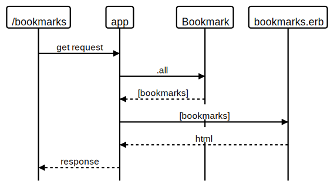

# bookmark_manager

## User Stories

```
As a user
So that I can see the bookmarks I have
I would like to get a list of bookmarks
```



## Database setup

```
psql

CREATE DATABASE "bookmark_manager";

\c bookmark_manager;

\dt
```

Navigate to `db/migrations` and run the SQL script
TODO: UPDATE bookmark_manager setup script to include all scripts


